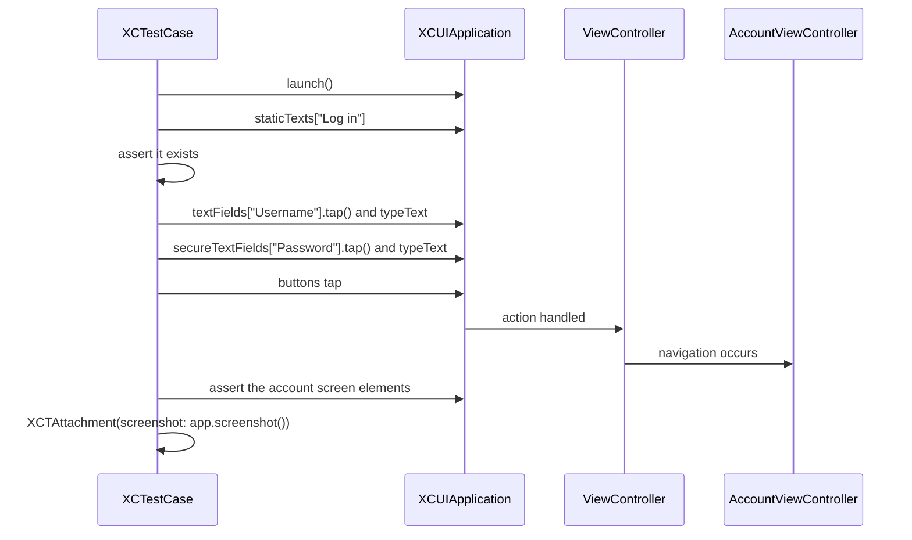

# UI Testing

*An XCUITest suite driving a login flow end to end.*

    

## Overview

A two screen application used as a target for UI tests. The tests launch the app, find real elements by their labels, type into them, tap through and assert what appears, with a screenshot attached to the report.

## How it works



## Implementation notes

- **Elements queried by type and label.** Using `staticTexts`, `textFields` and `secureTextFields` keeps the query specific, so a matching label elsewhere does not resolve first.
- **Secure fields are their own query.** A password field does not appear under `textFields`, which is a common source of failing tests.
- **Screenshots attached to the report.** `XCTAttachment` makes a failure diagnosable from CI output alone.
- **Launch per test.** Each test launches a fresh application instance, so no test depends on the state another one left behind.

## Project structure

```
Testing/
├── ViewController.swift          login screen
├── AccountViewController.swift   destination screen
└── TestingUITests/              the suite
```

## Requirements

Xcode 15 or later, iOS 17.5 or later. Run with the test action rather than the run action.
